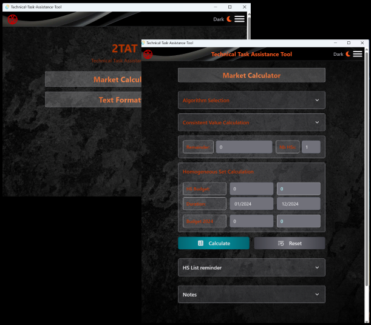

# 2TAT - Technical Task Assistance Tool

<p align="center">
  
</p>

## 📖 About

This application is designed to facilitate and secure financial management in the context of market operations. Initially, our starting point was a basic Excel spreadsheet used to manage and distribute budgets. However, significant areas for improvement were identified: the precision of calculations and financial distribution, as well as optimized ergonomics for a more user-friendly, simple, and intuitive experience.

2TAT is a specialized and specific business application; it is a tool for the purchasing department, seeking to optimize its financial distribution with precision and efficiency. But it is also, and most importantly, the starting point for a reflection on tools that can be developed and progressively integrated to secure and facilitate routine and technical activities.

## 🚀 Features

- Cross-platform desktop application using Tauri (Windows, macOS, Linux)
- Tauri's lightweight and secure native runtime
- Modern web interface built with React (minimalistic and intuitive at this stage)
- Fast development with Vite and Hot Module Replacement (HMR)
- Precise decimal arithmetic with Decimal.js
- Optimized financial calculations and distribution ("penny pinching" algorithm)
- User-friendly and intuitive interface

## 🛠️ Prerequisites

Before you begin, ensure you have met the following requirements:

- Node.js (12+)
- npm (6+) or Yarn
- Rust (for Tauri development)

## 🏗️ Installation

1. Clone the repository:

   ```bash
   git clone https://github.com/Frederic-K/Technical-Task-Assistance-Tool.git
   ```

2. Navigate to the project directory:

   ```bash
   cd Technical-Task-Assistance-Tool
   ```

3. Install dependencies:
   ```bash
   npm install
   # or
   yarn install
   ```

## 🚦 Development

To start the development server:

```bash
npm run dev
# or
yarn dev
```

This will start the Vite development server.

To run the Tauri application in development mode:

```bash
npm run tauri dev
# or
yarn tauri dev
```

## 🏭 Building for Production

To build the application for production:

```bash
npm run build
# or
yarn build
```

To build the Tauri application:

```bash
npm run tauri build
# or
yarn tauri build
```

## 🧹 Linting

To lint the codebase:

```bash
npm run lint
# or
yarn lint
```

## 🏗️ Project Structure

- `client/`: Contains the web application files
  - `src/`: Main source code for the web application
  - `public/`: Static files for the web application
- `src-tauri/`: Contains the Tauri application files
  - `src/`: Main source code for the Tauri application
  - `icons/`: Icons for the Tauri application
  - `target/`: Build output for the Tauri application

## 🛠️ Built With

- [Tauri](https://tauri.app/) - Framework for building tiny, blazing fast binaries for all major desktop platforms
- [React](https://reactjs.org/) - A JavaScript library for building user interfaces
- [Vite](https://vitejs.dev/) - Next Generation Frontend Tooling
- [Decimal.js](https://mikemcl.github.io/decimal.js/) - An arbitrary-precision Decimal type for JavaScript

## 👤 Author

Frédéric KREUDER

- GitHub: [@Frederic-K](https://github.com/Frederic-K)
- LinkedIn: [Frédéric Kreuder](www.linkedin.com/in/frédéric-kreuder)

```

```
